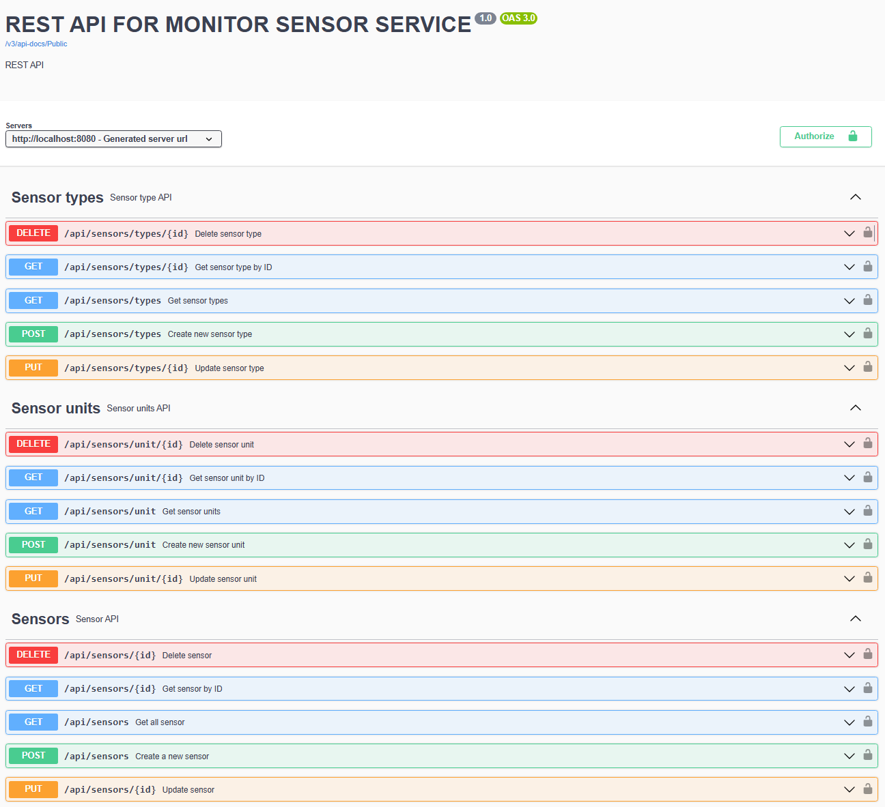

# Monitor sensor API
Implementation of a basic REST API for a monitoring sensors

# How to run application
1. Clone repository, go to root directory
2. Run sh run.sh in root directory
   sh run.sh will build the application and run it in a docker container
3. Open http://localhost:8085/swagger-ui/index.html#/ in browser
4. Click to button Authorize and input authorize data
   Default values:
   admin:321
   user:123
5. Select the interesting request and execute it 
6. Check results requests
